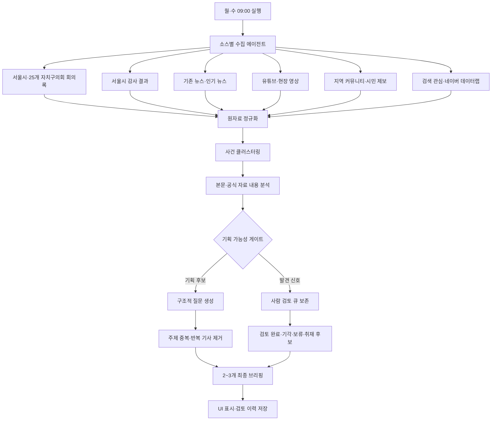

# 서울 기획 아이템 레이더 v3 통합 구조

## 목적

서울시민을 대상으로 하는 6~7분 방송용 기획 아이템을 주 2회 2~3건 제시한다. 단순 기사 요약이나 기관 홍보가 아니라, 구체적인 출발 사건을 서울 전체의 구조적 질문으로 확장한다.

## 전체 흐름

## 단계별 에이전트 역할

| 단계 | 에이전트 | 하는 일 | 산출물 |
|---|---|---|---|
| 1 | 수집 에이전트 | 담당 소스의 새 문서·게시물·영상 수집 | 원자료 피드 |
| 2 | 정규화 에이전트 | 제목, 본문, 날짜, 지역, URL, 출처를 통일 | 정규화 행 |
| 3 | 사건 클러스터 에이전트 | 같은 사건의 반복 보도를 하나로 묶음 | 사건 묶음 |
| 4 | 내용 분석 에이전트 | 본문에서 대상, 피해, 갈등, 책임 주체, 수치, 기간 추출 | 사실·불확실성 카드 |
| 5 | 기획 확장 에이전트 | 지역 사건을 서울 전체 구조와 시민 질문으로 확장 | 기획 질문 초안 |
| 6 | 다양성 게이트 에이전트 | 같은 주제·같은 사건·같은 소스를 중복 제거 | 후보 순위 |
| 7 | 사람 검토 큐 에이전트 | 자료 부족 후보도 버리지 않고 상태별 보존 | 검토 큐 |
| 8 | 헤드 브리핑 에이전트 | 검토 결과 중 2~3개만 최종 브리핑 작성 | 최종 브리핑 |
| 9 | UI·이력 에이전트 | 후보, 상태, 근거, 판정 이력을 화면에 표시 | 앱 데이터 |

## 소스별 발견 목표

- 의회 회의록: 발언 문장 자체가 아니라 구체적인 사건·주민·예산·갈등을 찾는다.
- 감사 결과: 적발 사실, 반복된 관리 부실, 책임 공백을 찾는다.
- 기존 뉴스: 이미 보도된 사건의 후속 변화와 남은 피해를 찾는다.
- 유튜브·커뮤니티: 현장 장면과 시민의 반복 제보를 찾되 단독 사실로 확정하지 않는다.
- 검색 관심: 갑작스러운 관심 변화를 찾는 보조 입력으로만 사용한다.

## 기획 가능성 게이트

최종 후보는 다음 조건을 충족해야 한다.

1. 구체적인 출발 사건이 있다.
2. 영향을 받는 시민 집단이 식별된다.
3. 서울 전체로 확장할 구조적 질문이 있다.
4. 확인 가능한 자료·현장·당사자가 있다.
5. 6~7분 리포트로 보여줄 장면 또는 비교 대상이 있다.

조건이 부족하면 기각하지 않고 DISCOVERY_ONLY 또는 CONTEXT_NEEDED로 보존한다.

## 반복 방지 규칙

- 검색어를 제목으로 복사하지 않는다.
- 기관 운영·홍보·행사 안내는 최종 후보에서 제외한다.
- 교통 운행 지연과 건설사업 지연을 분리한다.
- 같은 사건의 여러 기사는 하나의 사건 묶음으로 합친다.
- 같은 구조적 질문을 두 후보에 반복하지 않는다.
- 관심 큐가 비어 있을 때 오래된 브리핑으로 대체하지 않는다.
