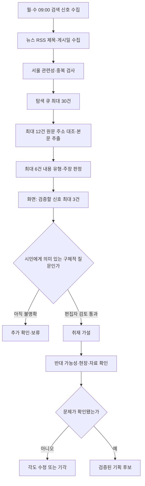

# 서울 기획 아이템 레이더 v3 통합 구조

## 목적

서울시민을 대상으로 하는 6~7분 방송용 기획 아이템을 주 2회 2~3건 제시한다. 단순 기사 요약이나 기관 홍보가 아니라, 구체적인 출발 사건을 서울 전체의 구조적 질문으로 확장한다.

## 현재 작동하는 흐름

현재 자동 실행은 E까지다. F·Q는 네이버 뉴스 검색에서 제목이 일치한 언론사 원문 주소를 찾고, 추출한 본문 중 최대 6건만 모델로 잠정 판정한다. 주소 불일치·본문 접근 실패·모델 오류는 이유를 남기고 제목 신호로 보존한다. Q는 독립 사실 확인이나 편집 승인 단계가 아니다. 따라서 검색 제목만 있는 실행에서는 '이번 편집 후보'가 0건일 수 있다. 0건을 오래된 브리핑이나 추정 질문으로 채우지 않는다.

서울시의회·구의회·감사·유튜브 등은 별도 수집·시험 경로에 있다. 읽기 전용 화면의 `소스별 탐색 현황`은 이 경로의 저장된 수집 상태·검토/보류 단서를 같은 형식으로 보여준다. 이는 최신 기획 후보 생성기로의 자동 편입이 아니며, 구의회 첫 화면 감시나 유튜브 검색 전략 기록을 본문 검증으로 취급하지 않는다. 최종 편집 후보의 사람 승인 게이트는 그대로 유지한다. 아래 역할표는 통합 목표와 구현 상태를 구분해 읽어야 한다.

## 단계별 에이전트 역할

| 단계 | 에이전트 | 하는 일 | 산출물 |
|---|---|---|---|
| 1 | 수집 에이전트 | 담당 소스의 새 문서·게시물·영상 수집 | 원자료 피드 |
| 2 | 정규화 에이전트 | 제목, 본문, 날짜, 지역, URL, 출처를 통일 | 정규화 행 |
| 3 | 사건 클러스터 에이전트 | 같은 사건의 반복 보도를 하나로 묶음 | 사건 묶음 |
| 4 | 내용 분석 에이전트 | 본문에서 대상, 피해, 갈등, 책임 주체, 수치, 기간 추출 | 사실·불확실성 카드 |
| 5 | 기획 확장 에이전트 | 지역 사건을 서울 전체 구조와 시민 질문으로 확장 | 기획 질문 초안 |
| 6 | 다양성 게이트 에이전트 | 같은 주제·같은 사건·같은 소스를 중복 제거 | 후보 순위 |
| 7 | 사람 검토 큐 에이전트 | 자료 부족 후보도 버리지 않고 상태별 보존 | 검토 큐 |
| 8 | 헤드 브리핑 에이전트 | 검토 결과 중 2~3개만 최종 브리핑 작성 | 최종 브리핑 |
| 9 | UI·이력 에이전트 | 후보, 상태, 근거, 판정 이력을 화면에 표시 | 앱 데이터 |

## 소스별 발견 목표

- 의회 회의록: 발언 문장 자체가 아니라 구체적인 사건·주민·예산·갈등을 찾는다.
- 감사 결과: 적발 사실, 반복된 관리 부실, 책임 공백을 찾는다.
- 기존 뉴스: 이미 보도된 사건의 후속 변화와 남은 피해를 찾는다.
- 유튜브·커뮤니티: 현장 장면과 시민의 반복 제보를 찾되 단독 사실로 확정하지 않는다.
- 검색 관심: 갑작스러운 관심 변화를 찾는 보조 입력으로만 사용한다.

## 기획 가능성 게이트

취재 가설로 검토할 때는 원문 맥락, 영향을 받을 수 있는 시민과 그 이유, 구체적인 질문, 반대 가능성, 첫 확인 경로를 적는다. 새 사업이거나 의원 발언 자체가 중요하다면 피해 통계가 없어도 검토할 수 있다. 문제 발생 여부는 확인 전까지 미판정으로 남긴다.

문제 발생을 사실로 말하는 최종 후보는 다음 조건을 충족해야 한다.

1. 구체적인 출발 사건이 있다.
2. 영향을 받는 시민 집단이 식별된다.
3. 서울 전체로 확장할 구조적 질문이 있다.
4. 확인 가능한 자료·현장·당사자가 있다.
5. 6~7분 리포트로 보여줄 장면 또는 비교 대상이 있다.

조건이 부족하면 기각하지 않고 DISCOVERY_ONLY 또는 CONTEXT_NEEDED로 보존한다.

## 반복 방지 규칙

- 검색 제목을 기획 제목이나 구조적 문제의 증거로 사용하지 않는다.
- 본문을 읽지 않은 신호에서 시민 피해·서비스 공백·지역 격차를 추정하지 않는다.
- 기관 운영·홍보·행사 안내는 최종 후보에서 제외한다.
- 교통 운행 지연과 건설사업 지연을 분리한다.
- 같은 사건의 여러 기사는 하나의 사건 묶음으로 합친다.
- 같은 구조적 질문을 두 후보에 반복하지 않는다.
- 관심 큐가 비어 있을 때 오래된 브리핑으로 대체하지 않는다.

## 뉴스 본문 판정의 한계

네이버 뉴스 검색의 원문 주소는 Google 뉴스 제목과 일치할 때만 사용한다. 언론사 HTML에서 본문을 추출하지 못하면 실패를 0건이나 무가치 판정으로 바꾸지 않는다. 본문 전문은 저장하지 않고 짧은 근거 구절·분류·검토 질문·원문 링크만 남긴다. 모델이 낸 근거 구절이 실제 추출 본문에 없으면 판정을 폐기한다. 본문 판정이 있어도 최종 편집 후보는 사람이 문제의 존재와 취재 가치를 확인하기 전까지 0건으로 유지한다.
