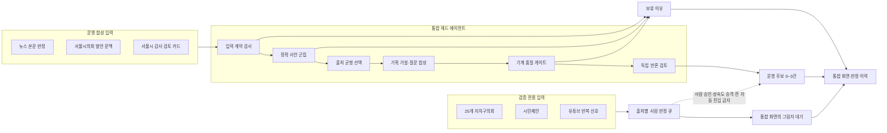

# 서울 기획 아이템 레이더 — 통합 헤드 구조

## 목적

서울시민 대상 6~7분 방송 기획 아이템을 월·수에 0~3건 제시한다. 단순 기사 요약이나 기관 홍보가 아니라 구체적인 출발 사건, 시민의 선택, 맞서는 설명, 첫 검증 경로와 방송 장면을 갖춘 취재 질문을 만든다.

## 현재 활성 구조

```mermaid
flowchart LR
  subgraph P[운영 합성 입력]
    N[뉴스 본문 판정]
    S[서울시의회 발언 문맥]
    A[서울시 감사 검토 카드]
  end
  subgraph W[검증 전용 입력]
    D[25개 자치구의회]
    C[시민제안]
    Y[유튜브 반복 신호]
  end
  subgraph H[통합 헤드 에이전트]
    H1[입력 계약 검사]
    H2[정확 사안 군집]
    H3[출처 균형 선택]
    H4[기획 가설·질문 합성]
    H5[기계 품질 게이트]
    H6[독립 반론 검토]
  end
  P --> H1 --> H2 --> H3 --> H4 --> H5 --> H6
  H6 --> O[운영 후보 0~3건]
  W --> R[출처별 사람 판정 큐]
  R --> U[통합 화면의 그림자 대기]
  R -. 사람 승인·성숙도 승격 전 자동 진입 금지 .-> O
  H1 --> X[보류 이유]
  H2 --> X
  H5 --> X
  O --> UI[통합 화면·판정 이력]
  U --> UI
  X --> UI
```

## 단계별 에이전트 역할

| 단계 | 역할 | 입력 | 산출물 |
|---|---|---|---|
| 1 | 소스 수집 | 각 공식·시민 신호 경로 | 원문 주소와 제한된 파생 근거 |
| 2 | 입력 계약 | 식별자·출처·HTTPS 주소·본문 근거·문맥 검사 | 유효 입력 또는 명시적 보류 |
| 3 | 정규화·사건 군집 | 서로 다른 출처 형식 | 출처군과 정확 사안 기준 묶음 |
| 4 | 출처 균형 선택 | 유효 입력 전체 | 모델 입력 최대 8건 |
| 5 | 기획 합성 | 사건 문맥·미검증 주장 | 제목, 주제, 시민 질문, 뜻밖의 질문, 반대 설명, 첫 취재, 장면 |
| 6 | 기계 품질 게이트 | 1차 제안 | 실제 연속 인용과 비반복 질문을 갖춘 제안 |
| 7 | 독립 반론 검토 | 제안과 원래 입력 | KEEP 또는 HOLD, 오판 위험과 결정적 검증 |
| 8 | 사람 판정 | 운영 후보·출처별 그림자 카드 | 완료·보류·기각·검토 가치 있음 |
| 9 | UI·이력 | 통합 결과와 판정 파일 | 출처별 상태·후보·보류·대기 수 |

## 출처별 발견 목표

- 뉴스: 이미 보도된 사건에서 남은 갈림길, 후속 변화, 다른 지역과 비교할 구조를 찾는다.
- 서울시·자치구의회: 발언 자체가 아니라 구체적 주민, 예산, 제도 선택과 맞서는 설명을 찾는다.
- 감사 결과: 지적 한 건보다 반복 관리 부실, 책임 공백, 실제 서비스 영향의 확인 경로를 찾는다.
- 시민제안·응답소: 시민의 직접 경험 표현과 기관 답변을 구분하고 반복 여부를 확인할 단서로 쓴다.
- 유튜브: 단일 조회수가 아니라 독립 채널에서 반복되는 행동·장면·서울 맥락을 찾는다.
- 검색 관심: 관심 변화의 보조 신호이며 단독 사실 근거로 쓰지 않는다.

## 핵심 경계

- 자료가 아직 없다는 이유만으로 새 사업이나 중요한 의원 질문을 버리지 않는다.
- 반대로 구조가 미확인이라는 이유로 흔적을 삭제하지 않고 HOLD 또는 그림자 큐에 남긴다.
- 제목만 있는 기사, 홍보 문구, 정책 목적, 공사·교통 키워드는 사건이나 피해의 증거가 아니다.
- 같은 회의록 URL에는 여러 발언이 있을 수 있으므로 URL만으로 중복 제거하지 않는다.
- 계획한 현장·킬러 테스트는 수행 결과가 아니다.
- 운영 후보 0건은 정상이다. 그림자 대기 수와 수집 실패는 별도 상태로 표시한다.
- 사람이 PROMISING으로 판정한 그림자 카드도 즉시 기사 후보가 아니라 성숙도 승격 검토 대상이다.

## 완료와 남은 일

통합 헤드 v1은 운영 입력과 세 개 그림자 큐를 한 실행 계약과 한 상태 화면으로 묶는다. 남은 고도화는 시스템 골격을 다시 만드는 일이 아니라 실제 월·수 판정 표본으로 출처별 유효 질문률·오탐·반복률을 비교하고, 승격 가치가 확인된 소스만 L5 운영 입력으로 올리는 일이다.
